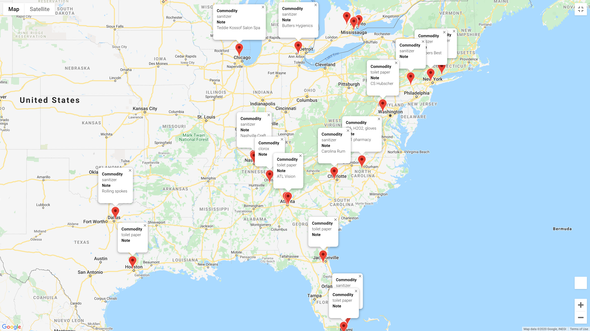

# Client Project - Finding Available Commodities During COVID-19

[Photo Source](https://www.furman.edu/covid-19/)

## Team Members 
[Jeong Huh](https://www.linkedin.com/in/jeong-huh/)
 [Royce Phillips Jr](https://www.linkedin.com/in/roycephillipsjr/)

## Motivation
COVID-19 is the worst pandemic in the past 100 years. It has made millions of people sick and as of May of 2020, more than 300,000 died from COVID-19 related symptoms. It has brought numerous life-changing experiences, such as stay-at-home orders, shortage of hospital beds and medical supplies and so forth. However, one of the issues that everyone around the world is facing is shortage of commodities such as certain food, hygiene and personal protection products such as sanitizer, disinfectant wipes, mask and isopropyl alcohol. A lot of stockpiling occurred with panic purchasing and it has become difficult to locate and acquire certain items. Based on these facts, our team wanted to see if it is possible to locate these commodities with information available to everyone online and map essential items so it can help people get access to them as easy as possible.

To see the problem statement we chose. [Problem 17](Presentation_Files/problem_17.txt)

## Quick Summary
Looking through this notebook you can see all the information you need to find on how our team worked to find available commodaties during the COVID-19 pandemic. The data was created by pulling the information from [Twitter's developer API](https://developer.twitter.com/en/docs). The dataset was then created from those tweets that were pulled and then cleaned and parsed. The tweets were cleaned with Beautiful Soup and Regex. Then the words were CountVectorized and fit into a DBSCAN model. The geo coordinates that were found were then put on Google maps using a [Google map API](https://developers.google.com/maps/documentation).

## Software Requirements
- JSON
- Tweepy
- Pandas
- Numpy
- Datetime
- Time
- Beautiful Soup
- Regex
- NLTK Stopwords
- Scikit-Learn CountVectorizer, TfidfVectorizer, DBSCAN, Silhouette Score, StandardScaler
- GMAP

#### Below you can see links to the jupyter notebooks, data, and references:

## Jupyter Notebooks:

1. [Data Gathering](Code/00_Gathering_tweets.ipynb)
2. [Gathering Coordinates](Code/01_Gathering_coordinates.ipynb)
3. [Cleaning tweets](Code/02_Cleaning_tweets.ipynb)
4. [Preprocessing and Modeling](Code/03_Preprocessing_Modeling.ipynb)
5. [All Commodities](Code/04_All_commodities.ipynb)
6. [GMAP Location](Code/05_gmap-location.ipynb)

## Data:
- [Original Tweets](datasets/all_commodities_tweets.csv)
- [Original Tweets with Cleaned Tweets](datasets/cleaned_tweets.csv)
- [Tweets GPS](datasets/tweets_gps.csv)

##  References
- [Twitter](https://twitter.com/) - Source where we grabbed all our data
- [Twitter API](https://developer.twitter.com/en/docs) - Tool we used to grab all the tweets
- [Twitter API Tutorial](http://socialmedia-class.org/twittertutorial.html) - A guide on how to use Twitter API
- [Source Code for gathering tweets](https://www.youtube.com/watch?v=WX0MDddgpA4&list=PL5tcWHG-UPH2zBfOz40HSzcGUPAVOOnu1&index=3) - YouTube video on further uses of Twitter API
- [Tweepy Documentation](http://docs.tweepy.org/en/v3.8.0/index.html) - Tweepy documentation on how to use this library
- [Google Maps API](https://developers.google.com/maps/documentation) - API used to pinpoint locations on a map

##  Data Dictionary
Feature|    Type|    Dataset|Data Retrieved From|Description|
-------|--------|-----------|-------------------|-----------|
**tweets**|object|cleaned_tweets|Twitter API|text of the tweet|
**id**|float|cleaned_tweets|Twitter API|id of the tweet|
**name**|object|cleaned_tweets|Twitter API|name of twitter page|
**location**|object|cleaned_tweets|Twitter API|location of twitter page|
**coordinates**|object|cleaned_tweets|Twitter API|coordinates of where tweet was posted|
**created_at**|object|cleaned_tweets|Twitter API|when the tweet was created|
**favorite_count**|float|cleaned_tweets|Twitter API|how many people favorited the tweet|
**geo**|object|cleaned_tweets|Twitter API|geo location of tweet|
**source**|object|cleaned_tweets|Twitter API|the source where tweet came from|
**clean_tweets**|object|cleaned_tweets|Twitter API|cleaned tweets, removed characters|

## Summary

In the past few years, there have been several emergencies in the United States, such as massive hurricanes, wildfires and COVID-19 pandemic. In those situations, critical resources can make a real difference in one's life and also the location of those resources. We have used twitter as the main information gathering tool to locate available commodities during CVOID-19 pandemic and Google Map as the main delivery platform to share the information. We successfully opened a Twitter Developers account and generated an API key to download and collect thousands of tweets. Also wrote a code to screen and parse relevant data pertaining to commodities and filter and collect corresponding GPS locations for the location of commodities. In order to use Google Maps, it was also required to open a Developers account in Google Clouds and generate an API key. Gmaps Python library was used to map the location and relevant information on Google Maps and finally Javascript was used to open the Google Maps with commodities of interest online so anyone interested can look it up with the link. Overall the project showcased the feasibility of a proof-of-concept prototype of an emergency mapping API.

## Future Work

When we started this project, we were hoping to see a commodity availability map of Austin, Texas. It did not take a long time to realize that goal was going to be difficult to achieve. The main reason was due to the scarcity of relevant tweets. The free tier API key from Twitter only allows you to download a limited number of tweets and only 7 prior days from the time of download. Knowing that only 3% of the tweets had GPS location attached to them, we would have needed tens of thousands of tweets to get enough data to generate a local commodity map. If this project had a budget behind it, I believe the data availability problem should have been easily overcome. However, with a more urgent emergency such as wildfire or hurricanes, I can envision having many more tweets being generated at a short amount of time in a relatively smaller geographical region. In such cases, I believe it would serve its purpose even with the limited API key from twitter.

The fact that a human had to go through the tweets and read the texts to filter out the essential ones also needs improvements. With more time and manpower, it would be possible to write a Natural Language Processing code to parse through the tweets and select the ones that were relevant to the commodities in stock. With a more urgent emergency, this would be essential to the success of the emergency mapping functionality for fast turnaround time. 

For more in depth knowledge on our process check this [document](Presentation_Files/Executive_Summary_COVID.pdf)
For the [powerpoint presentation](Presentation_Files/PPT_COVID19-Commodity-Map.pdf)

